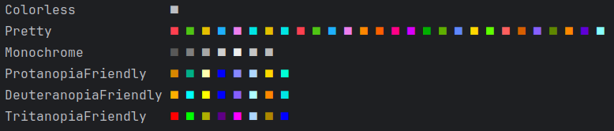

# Documentation

Here are all available operations of `ansiplot`. The main model is that
you create a so-called canvas, which represents a surface you can draw
on. Canvases have methods for adding data, and methods for obtaining the
final result, such as `show()` that prints to the console.


Canvases <br>[Canvas](#canvas)
-- [Scaled](#scaled)
-- [Rect](#rect)

Plot methods<br>[plot](#plot)
-- [scatter](#scatter)
-- [bar](#bar)

<h3>

## Palettes

In all canvases below, you are able to set a color palette. Here is a
list of those, obtained with `ansiplot.palette.info()`.




<hr>

## Canvas

Canvases offer different types of plotting. There are currently two canvas
types, both inherited from `ansiplot.Canvas`. For example, you may want to 
autoscale the axes or set fixed limits. The base canvas class is _abstract_,
but it serves as basis for the next ones.

## Scaled

A canvas that scales to always fit its contents.

**Constructor arguments:**
- _width_ is the number of horizontal characters in the canvas areas.
- _height_ is the number of vertical characters in the canvas areas.
- _symbol_state_ is an optional argument to specify a specific substyle
arising from the color palette. Default is `0`.
- _palette_ is an optional argument that specifies the aesthetics
of the axis and of automatically generated symbols. If not provided
or set to None,`ansiplot.palette.Pretty` is used.
- _axis_ is an optional boolean argument that can be set to `False`
to not draw the default axis on the canvas; it will start off as 
a blank area.

**Example:**

```python
import ansiplot
canvas = ansiplot.Rect(60, 20, palette=ansiplot.palette.Colorless)
```

This creates black-and-white canvas.
For examples on how to plot on a canvas, see below.

## Rect

A rectangle canvas that determines a specific bounded box.

**Constructor arguments:**
- _width_ is the number of horizontal characters in the canvas areas.
- _height_ is the number of vertical characters in the canvas areas.
- _xlimits_ is a tuple in the form of `(xmin,xmax)` that contains
the minimum and maximum numerical values of the horizontal axis that
can be displayed.
- _ylimits_ is a tuple in the form of `(ymin,ymax)` that contains
the minimum and maximum numerical values of the vertical axis that
can be displayed.
- _symbol_state_ is an optional argument to specify a specific substyle
arising from the color palette. Default is `0`.
- _palette_ is an optional argument that specifies the aesthetics
of the axis and of automatically generated symbols. If not provided
or set to None,`ansiplot.palette.Pretty` is used.
- _axis_ is an optional boolean argument that can be set to `False`
to not draw the default axis on the canvas; it will start off as 
a blank area.

The canvas strictly adheres to its width requirements, and takes
two more vertical lines to display its limit values. Additional lines
are taken up only if the legend is shown (which is the default behavior
when there are titled plots, but can be hidden with an appropriate
argument).

**Example:**

```python
import ansiplot
canvas = ansiplot.Rect(60, 20, xlimits=(0,1), ylimits=(0,1))
```

This creates axes that are unit intervals.
For examples on how to plot on a canvas, see below.

<hr>

## plot

Generates a continuous plot that links consecutive points based on 
Bresenham's line algorithm. In addition to this algorithm, heuristics
are applied to make sure that overlapping plots do not fully obscure
each other.

**Arguments:**
- _x_ is an iterable of float values.
- _y_ is an iterable of float values.
- _title_ is an optional string. If provided, a mnemonic containing the respective 
description will appear in the canvas's legend.
- _symbol_ is an optional string with visible length of one character.
If provided, it replaces the plot's symbol. It may contain its own ANSI 
characters, otherwise, it is set to be white. If this argument is not provided,
a colored symbol is chosen from the canvas's palette.

Plotting checks whether _x,y_ have the same number of elements. A `float(...)` 
conversion is also applied on each of their elements.

**Example:**

```python
import ansiplot

x = list(range(100))
y = [value**2 for value in x]

canvas = ansiplot.Scaled(40, 10, palette=ansiplot.palette.Colorless)
canvas.plot(x, y, title="Squares")
canvas.show()
```

```plaintext
(0.0, 9801.0)
▎                                      *
▎                                    ***
▎                                 ****  
▎                              ****     
▎                            ***        
▎                         ****          
▎                     *****             
▎                 *****                 
▎            ******                     
**************▬▬▬▬▬▬▬▬▬▬▬▬▬▬▬▬▬▬▬▬▬▬▬▬▬▬
                             (99.0, 0.0)

 * Squares
```

## scatter

Is identical to plot, with the only difference being that points
are not connected if they end up disjointed. It may look very similar,
and even learner, for continuous curves and in small canvas sizes.

**Example:**

```python
import ansiplot

x = [5,3,4,1,2]
y = [1,5,4,2,3]

canvas = ansiplot.Scaled(40, 10, palette=ansiplot.palette.Colorless)
canvas.scatter(x, y)
canvas.show()
```

```plaintext
(1.0, 5.0)
▎                  *                    
▎                                       
▎                                       
▎                            *          
▎                                       
▎        *                              
▎                                       
*                                       
▎                                       
▎▬▬▬▬▬▬▬▬▬▬▬▬▬▬▬▬▬▬▬▬▬▬▬▬▬▬▬▬▬▬▬▬▬▬▬▬▬▬*
                              (5.0, 1.0)
```


## bar

Draws a vertical line.

- _x_ is a float showing the horizontal position of the bar.
- _y_ is either `None` to span the whole vertical breadth,
a tuple of floats `(ymin, ymax)` specifying a vertical linear
segment, or a single float to be interpreted as `(0,y)`.
- _title_ is the same as the titles of other plots.
- _symbol_ is the same as the symbols of other plots.

**Example:**

```python
import ansiplot

values = {"dogs": 59.8E6, "cats": 42.2E6, "fish": 4.9E6, 
          "reptiles": 2.3E6, "birds": 2.1E6, "small mammals": 1.3E6}

canvas = ansiplot.Scaled(40, 10, axis=False)
for pos, (key, value) in enumerate(values.items()):
    canvas.bar(pos, value, title=key)
canvas.show()
```


Statistics taken from [here](https://www.avma.org/resources-tools/reports-statistics/us-pet-ownership-statistics).