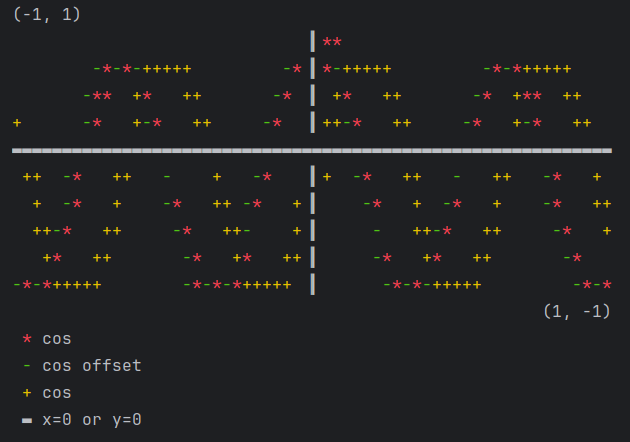

# Showcase

For a detailed example,
prepare three curves:
two similar cosine functions that lie close to 
each other, and a sine function.

```python
import math

x = [(i - 100) * 0.01 for i in range(200)]
y1 = [math.cos(value * 10) for value in x]
y2 = [math.cos(value * 10 + 0.1) for value in x]
y3 = [math.sin(value * 10) for value in x]
```

Import `ansiplot` and create a rectangle
60x10 canvas. This has specific scaling limits,
but you can also use the `Scaled` canvas from
before to automatically detect those limits.
For demonstration purposes,
hide the default axis to add some on specific
locations at the end with `bar` and `hbar`. 
Those forcefully rewrite entries, whereas other
plots try to preserve some overwritten information
from being hidden if they can help it.

```python
import ansiplot
from ansiplot.palette import Pretty

plot = ansiplot.Rect(60, 10, 
     xlimits=(-1, 1), 
     ylimits=(-1, 1), 
     axis=False, 
     palette=Pretty)
plot.plot(x, y1, title="cos")
plot.plot(x, y2, title="cos offset")
plot.plot(x, y3, title="cos")
# plot a custom axis
plot.bar(0, (-1, 1), symbol=Pretty.separator)
plot.hbar((-1, 1), 0, symbol=Pretty.xaxis, title="x=0 or y=0")
# show
plot.show()
```




Get the text manually with `plot.text()`.
Both this and the show can export to the 
colorless palette, which does not use ANSI.
This is useful for exporting to
files. Both methods also control whether 
legends are shown.
Here is an example for exporting the canvas
to a file:

```python
with open("example.txt", "w") as file:
    file.write(plot.text(colorless=True, legend=True))
```